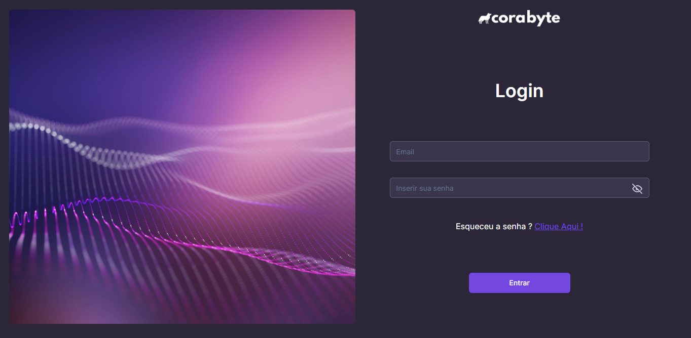
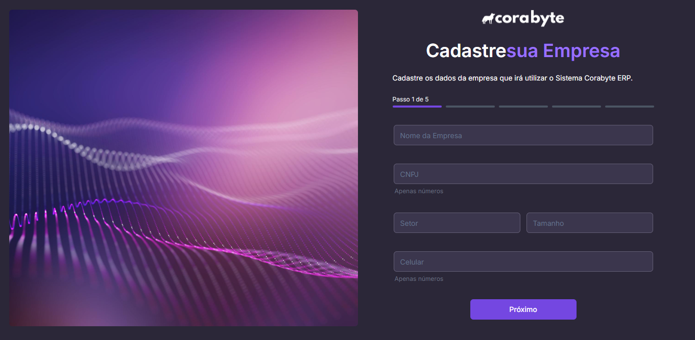
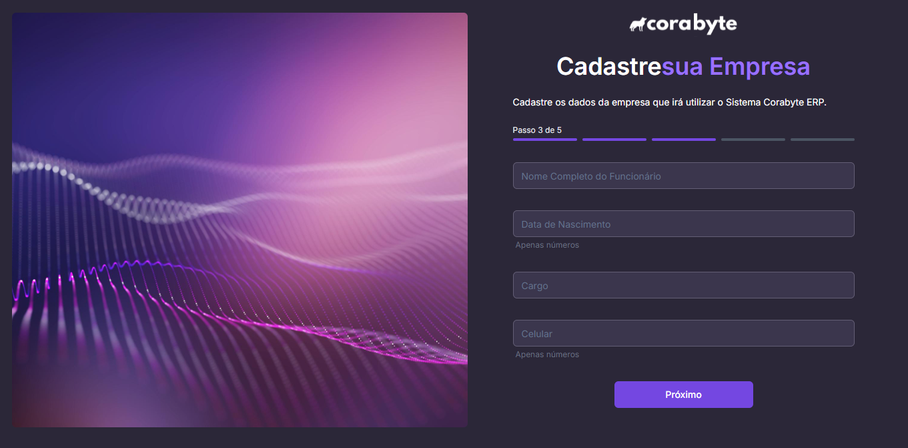
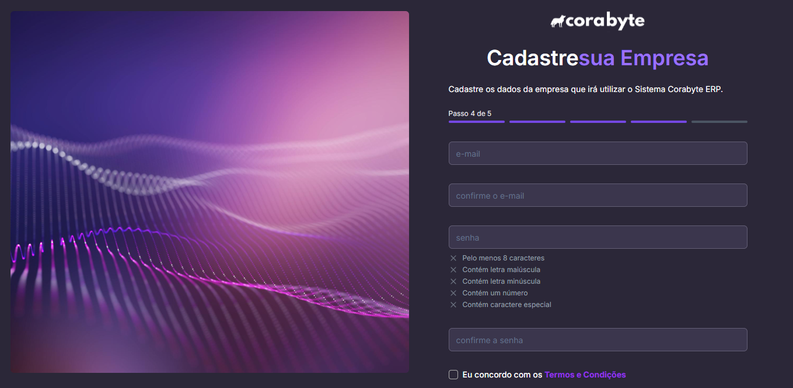
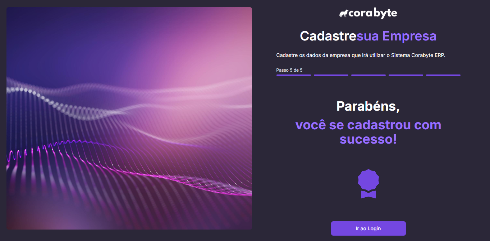

# Bem-vindo ao Sistema ERP Corabyte

## 1. Introdução

### Visão Geral

O ERP Corabyte foi desenvolvido para facilitar a gestão empresarial de forma intuitiva e eficaz. Este guia oferece uma visão geral das principais funcionalidades que você pode usar para otimizar suas operações.

## 2. Navegação no Sistema

### Login

Para começar, faça login no sistema utilizando seu e-mail e senha. Caso tenha esquecido sua senha, você pode recuperá-la de maneira rápida.

| **Campo/Local**               | **Função**                                                                         |
|-------------------------------|------------------------------------------------------------------------------------|
| **Email**                     | Insira seu e-mail de acesso.                                                       |
| **Senha**                     | Insira sua senha de acesso.                                                        |
| **Esqueci a senha**           | Clique para recuperar sua senha via e-mail.                                        |
| **Login**                     | Clique para acessar o sistema e iniciar na tela Dashboard.                         |

### Recuperação de Senha

Se precisar recuperar sua senha, insira seu e-mail para receber um código de verificação. Siga as instruções para redefinir sua senha com segurança.

| **Campo/Local**               | **Função**                                                                         |
|-------------------------------|------------------------------------------------------------------------------------|
| **Email**                     | Insira o e-mail associado à sua conta para enviar o código de recuperação.          |
| **Enviar**                    | Clique para enviar o código de recuperação para o e-mail fornecido.                |

### Verificação de Código de Recuperação

Após receber o código por e-mail, insira-o para prosseguir com a recuperação de sua senha.

| **Campo/Local**               | **Função**                                                                         |
|-------------------------------|------------------------------------------------------------------------------------|
| **Código**                    | Insira o código enviado para o seu e-mail.                                         |
| **Enviar código novamente**   | Clique para receber um novo código de recuperação.                                 |
| **Verificar Email**           | Clique para confirmar o código e continuar com a redefinição da senha.             |

### Cadastro de Empresa

Você pode cadastrar sua empresa no sistema seguindo um processo simples e dividido em 5 etapas. Cada etapa solicita informações essenciais para o registro completo da sua empresa.

#### Cadastro de Empresa - Etapa 1

Nesta etapa, forneça as informações básicas da sua empresa, como nome, CNPJ, setor de atuação, tamanho, e contato.

| **Campo/Local**               | **Função**                                                                         |
|-------------------------------|------------------------------------------------------------------------------------|
| **Nome da Empresa**           | Insira o nome da sua empresa.                                                      |
| **CNPJ**                      | Insira o CNPJ da sua empresa.                                                      |
| **Setor**                     | Informe o setor operacional da sua empresa.                                        |
| **Tamanho**                   | Informe o tamanho da sua empresa.                                                  |
| **Celular**                   | Informe o contato de celular da sua empresa.                                       |
| **Próximo**                   | Avance para a próxima etapa do registro.                                           |

#### Cadastro de Empresa - Etapa 2

Informe o endereço completo da sua empresa, incluindo CEP, número e complemento, se aplicável.

| **Campo/Local**               | **Função**                                                                         |
|-------------------------------|------------------------------------------------------------------------------------|
| **CEP**                       | Insira o CEP da empresa.                                                           |
| **Endereço**                  | Insira o endereço completo da empresa.                                             |
| **Número**                    | Informe o número do endereço.                                                      |
| **Complemento**               | Insira o complemento do endereço, se necessário.                                   |
| **Cidade**                    | Informe a cidade onde a empresa está localizada.                                   |
| **UF**                        | Informe o estado (UF) da empresa.                                                  |
| **País**                      | Informe o país da empresa.                                                         |
| **Próximo**                   | Avance para a próxima etapa do registro.                                           |

#### Cadastro de Empresa - Etapa 3

Nesta etapa, forneça os dados de um funcionário que utilizará o sistema, como nome completo, data de nascimento, cargo, e telefone celular.

| **Campo/Local**               | **Função**                                                                         |
|-------------------------------|------------------------------------------------------------------------------------|
| **Nome do Funcionário**       | Insira o nome completo do funcionário.                                             |
| **Data de Nascimento**        | Informe a data de nascimento do funcionário.                                       |
| **Cargo**                     | Informe o cargo do funcionário.                                                    |
| **Celular**                   | Informe o telefone celular do funcionário.                                         |
| **Próximo**                   | Avance para a próxima etapa do registro.                                           |

#### Cadastro de Empresa - Etapa 4

Informe o e-mail e crie uma senha para acesso ao sistema. Certifique-se de que o e-mail e a senha estejam corretos.

| **Campo/Local**               | **Função**                                                                         |
|-------------------------------|------------------------------------------------------------------------------------|
| **Email**                     | Insira o e-mail da empresa para acesso ao sistema.                                 |
| **Confirme o Email**          | Confirme o e-mail fornecido anteriormente.                                         |
| **Senha**                     | Crie uma senha segura para acesso ao sistema.                                      |
| **Confirme a Senha**          | Confirme a senha criada.                                                           |
| **Termos e Condições**        | Marque para concordar com nossos termos e condições.                               |
| **Próximo**                   | Avance para a última etapa do registro.                                            |

#### Cadastro de Empresa - Etapa 5

Finalizado o cadastro, você será redirecionado para a tela de login para acessar o sistema.

| **Campo/Local**               | **Função**                                                                         |
|-------------------------------|------------------------------------------------------------------------------------|
| **ir ao Login**               | Clique para acessar a tela de login e utilizar o sistema com os dados registrados. |

## 3. Principais Funcionalidades

### Gestão de Estoque

- Controle de entrada e saída de produtos.
- Alertas de reabastecimento.

### Gestão de Compras

- Pedido de compras automatizado.
- Controle de fornecedores.
- Análise de custos e prazos de entrega.

### Gestão de Vendas

- Processamento de pedidos.
- Gestão de clientes e CRM.
- Emissão de notas fiscais.

### Gestão de Produção (Indústria)

- Planejamento e controle da produção.
- Gestão de ordens de produção.
- Cálculo de custos de produção.

### Gestão Financeira

- Controle de contas a pagar e receber.
- Fluxo de caixa e conciliação bancária.
- Relatórios financeiros.

### Recursos Humanos

- Controle de folha de pagamento.
- Gestão de benefícios e treinamentos.
- Monitoramento de jornadas e ponto eletrônico.

### Relatórios e Análises

- Relatórios personalizados.
- Dashboards com indicadores de performance (KPIs).
- Integração com ferramentas de BI (Business Intelligence).

## 4. Tecnologias Utilizadas

- **Frontend:** React, Next.
- **Backend:** Node.js, Express, MongoDB/SQL ou PostgreSQL.
- **Integração:** APIs para comunicação entre módulos.
- **Segurança:** JWT para autenticação e SSL para comunicações seguras.

## 5. Próximos Passos

Explore o sistema ERP Corabyte e veja como ele pode simplificar a gestão da sua empresa. Se precisar de ajuda, consulte os tutoriais ou entre em contato com o suporte.
